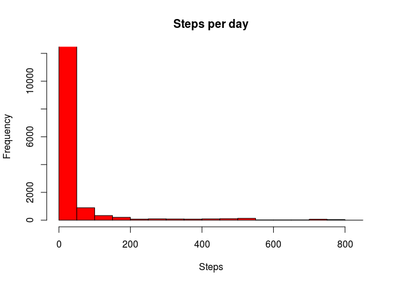
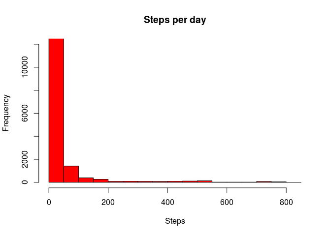
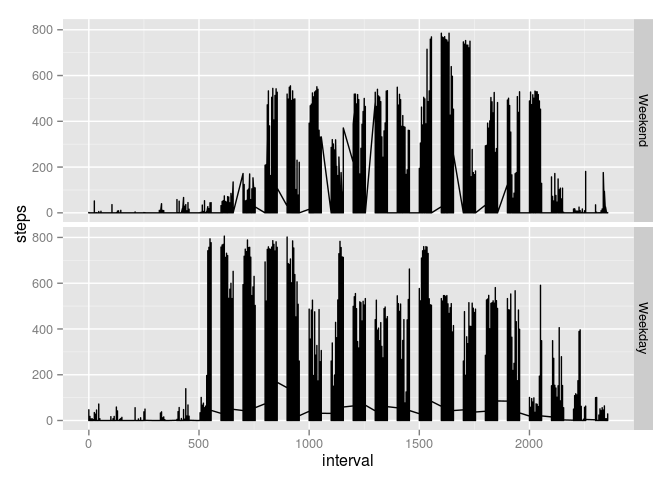

# Reproducible Research: Peer Assessment 1
Jeremy Shantz  

## Loading and preprocessing the data

We downloaded the data set from [here](https://d396qusza40orc.cloudfront.net/repdata%2Fdata%2Factivity.zip) on 2014-01-09.


```r
suppressPackageStartupMessages(library(xtable))
suppressPackageStartupMessages(library(dplyr))
suppressPackageStartupMessages(library(ggplot2))
data.url <- 'https://d396qusza40orc.cloudfront.net/repdata%2Fdata%2Factivity.zip'

if (!file.exists('./activity.zip')) {
    download.file(data.url, './activity.zip', method='curl')
}

unzip('./activity.zip')
data <- read.csv('./activity.csv')
```

## What is mean total number of steps taken per day?

#### Store the step values, ignoring the missing values in the dataset.

```r
steps <- subset(data, !is.na(steps), steps)[,1]
```

#### Histogram of the total number of steps taken each day

```r
hist(steps, main="Steps per day", xlab="Steps", ylim=range(0, 12000), col="red")
```

 

#### Mean and median steps per day

```r
# Display nicely by combining into a matrix to render as a table
m <- matrix(c(mean(steps), median(steps)), 
            dimnames = list(c("mean", "median"), c('Steps per day')))

print(xtable(m), type = "html")
```

<!-- html table generated in R 3.1.2 by xtable 1.7-4 package -->
<!-- Sat Jan 17 18:20:35 2015 -->
<table border=1>
<tr> <th>  </th> <th> Steps per day </th>  </tr>
  <tr> <td align="right"> mean </td> <td align="right"> 37.38 </td> </tr>
  <tr> <td align="right"> median </td> <td align="right"> 0.00 </td> </tr>
   </table>

## What is the average daily activity pattern?

#### Make a time series plot (i.e. type = "l") of the 5-minute interval (x-axis) and the average number of steps taken, averaged across all days (y-axis)


```r
# Remove NAs from the data set
without.na <- data[!is.na(data$steps),]
# Group by the interval column and summarize average steps
grouped.by.interval <- without.na %>% 
    group_by(interval) %>% summarize(mean(steps))
# Improve the column names
names(grouped.by.interval) <- c('interval', 'steps')
# Plot the pairs
plot(steps ~ interval, data = grouped.by.interval, type = 'l', 
     xlab = 'Interval', ylab = 'Average steps')
```

 

#### Which 5-minute interval, on average across all the days in the dataset, contains the maximum number of steps?

```r
maxInterval <- grouped.by.interval[grouped.by.interval$steps == 
                                       max(grouped.by.interval$steps),1][[1]]
```

The **835** interval contains the maximum number of steps (averaged across all dates in the dataset).

## Imputing missing values

#### The total number of missing values in the dataset (i.e. the total number of rows with NAs)

```r
missing.row.count <- length(data[is.na(data$steps),1])
```

There are **2304** rows where steps are not available.

#### Filling in all of the missing values in the dataset

Our strategy is to replace with NAs with the average value for that interval calculated across all the days in the dataset.


```r
# Create a new dataset that is equal to the original dataset.....
imputed = data

#  .....but with the missing data filled in.
# If steps is NA, store the average for that interval (already calculated),
#   otherwise, store the steps value
imputed$steps <- ifelse(is.na(data$steps), 
                        grouped.by.interval[grouped.by.interval
                                             == data$interval,2][[1]], 
                        data$steps)
```

#### Histogram of the total number of steps taken each day (with imputed values)

```r
hist(imputed$steps, main="Steps per day", xlab="Steps", ylim=range(0, 12000), 
     col="red")
```

 

#### Mean and median steps per day (with imputed values)

```r
# Display nicely by combining into a matrix to render as a table
m <- matrix(c(mean(imputed$steps), median(imputed$steps)), 
            dimnames = list(c("mean", "median"), c('Steps per day')))

print(xtable(m), type = "html")
```

<!-- html table generated in R 3.1.2 by xtable 1.7-4 package -->
<!-- Sat Jan 17 18:20:35 2015 -->
<table border=1>
<tr> <th>  </th> <th> Steps per day </th>  </tr>
  <tr> <td align="right"> mean </td> <td align="right"> 37.38 </td> </tr>
  <tr> <td align="right"> median </td> <td align="right"> 0.00 </td> </tr>
   </table>

#### Do these values differ from the estimates from the first part of the assignment? 
These values do not differ from the estimates from the first part of the assignment. There has been no impact from imputing missing data on the estimates of the total daily number of steps.  

* When we removed NAs, the length of the steps set was 15264 and the mean was 37.3825996.
* With imputed values replacing NAs, the length is 17568 and the mean is 37.3825996.
* The median is zero in both cases.

## Differences in activity patterns between weekdays and weekends?

```r
# Use the dataset with the filled-in missing values for this part.
# Create a new factor variable in the dataset 
#   with two levels – “weekday” and “weekend” 
#   indicating whether a given date is a weekday or weekend day.
week.part <- ifelse(weekdays(as.Date(as.character(imputed$date))) 
                    %in% c('Saturday', 'Sunday'), 'weekend', 'weekday')

imputed$week <- factor(week.part, levels = c('weekend', 'weekday'), 
                       labels = c('Weekend', 'Weekday'))
```

Panel plot containing a time series plot (i.e. type = "l") of the 5-minute interval (x-axis) and the average number of steps taken, averaged across all weekday days or weekend days (y-axis). 
 

```r
ggplot(imputed, aes(interval, steps)) + geom_line() + facet_grid(week~.)
```

 

    **Your plot will look different from the one above** because you will be 
    using the activity monitor data. Note that the above plot was made using 
    the lattice system but you can make the same version of the plot using 
    any plotting system you choose.
   
